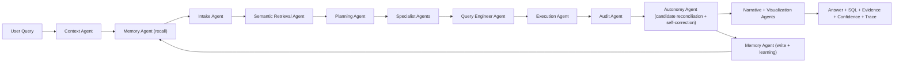

# dataDa

Status date: February 20, 2026

`dataDa` is an autonomous ecosystem of agents forming a complete data analytics team. It takes a natural language prompt, extracts semantic understanding, fetches data, performs research and probing, and delivers a final presentation that instills confidence: what data was there, what it told the system, what it means, what each agent contributed, and a transparent way to identify and correct failures.

It is built as an agentic analytics runtime with bounded autonomy: agents decompose tasks, generate and evaluate alternatives, audit results, self-correct when evidence is stronger, accumulate institutional knowledge, and defend their conclusions with evidence.

## Why dataDa

Most AI chat tools are good at language but weak at accountable analytics on private enterprise data. dataDa is designed for:

- grounded answers (SQL + sample rows + statistical validation + checks)
- transparent execution (agent trace + confidence breakdown + per-agent contribution)
- bounded autonomy (self-correction without unsafe side effects)
- institutional learning (knowledge base that grows beyond sessions and users)
- deployment flexibility (deterministic, local LLM, OpenAI, or auto)

## Product Scope

### Target users

- data and analytics teams
- operations and business teams that need conversational BI
- enterprises with privacy/governance constraints

### What this is

- a verifiable autonomous analytics engine
- a multi-agent data analyst team
- an open and inspectable runtime that accumulates institutional knowledge

### What this is not

- an unrestricted autonomous system that can silently mutate production systems
- a generic chatbot without lineage

## Current Architecture



## Bounded Autonomy

Autonomy in `dataDa` is intentionally split into two layers:

- cognitive autonomy: agents can decompose tasks, generate alternatives, self-check, self-correct, and learn
- operational bounds: policies limit unsafe side effects, not intelligence

Controls exposed in API:

- `autonomy_mode`
- `auto_correction`
- `strict_truth`
- `max_refinement_rounds`
- `max_candidate_plans`

## Quick Start

### 1. Environment

```bash
cd /Users/moenuddeenahmadshaik/Desktop/dataAssistantGenAI/haikugraph
python3 -m venv .venv
source .venv/bin/activate
pip install -e .
```

### 2. Ingest data (Excel files)

```bash
haikugraph ingest --data-dir ./data --db-path ./data/haikugraph.db --force
```

### 3. Or point to an existing database

```bash
haikugraph use-db --db-path /path/to/existing.duckdb
```

### 4. Run web app

```bash
./run.sh
# UI: http://localhost:8000
# API docs: http://localhost:8000/docs
```

## API Examples

### Query with autonomy controls

```bash
curl -s -X POST http://localhost:8000/api/assistant/query \
  -H 'Content-Type: application/json' \
  -d '{
    "goal": "What is the forex markup revenue for December 2025?",
    "llm_mode": "auto",
    "session_id": "demo-session-1",
    "autonomy_mode": "bounded",
    "auto_correction": true,
    "strict_truth": true,
    "max_refinement_rounds": 2,
    "max_candidate_plans": 6,
    "storyteller_mode": true
  }'
```

### Provide feedback and optionally teach a correction rule

```bash
curl -s -X POST http://localhost:8000/api/assistant/feedback \
  -H 'Content-Type: application/json' \
  -d '{
    "trace_id": "optional-trace-id",
    "session_id": "demo-session-1",
    "goal": "forex in december 2025",
    "issue": "Mapped to transactions when I expected quotes",
    "keyword": "forex",
    "target_table": "datada_mart_quotes",
    "target_metric": "forex_markup_revenue",
    "target_dimensions": ["__month__"]
  }'
```

## Data Stores Used by Runtime

- primary analytics DB: `HG_DB_PATH` or default `./data/haikugraph.db`
- autonomous memory DB: default `<primary_db_stem>_agent_memory.duckdb`
  - override with `HG_MEMORY_DB_PATH`
- connection registry DB map: `HG_CONNECTION_REGISTRY_PATH` or default `./data/connections.json`

## Connection Routing

`db_connection_id` is fully active in runtime.

- queries are routed to a registered connection
- per-connection team runtime is cached and reused
- sessions are scoped by `connection_id:session_id` to prevent cross-source context bleed
- UI includes a connection selector + refresh action

Connection APIs:

- `GET /api/assistant/connections`
- `POST /api/assistant/connections/upsert`
- `POST /api/assistant/connections/default`
- `POST /api/assistant/connections/test`

---

## Progress Tracker

### Completed foundations (Epics 1-5): 100%

| Epic | Status | Notes |
|---|---|---|
| 1. Unified ingestion + direct DB attach | complete | one ingestion path, direct attach, startup self-heal |
| 2. Semantic intelligence reliability | complete | typed marts, semantic versioning, coverage profiling |
| 3. Agent autonomy core | complete | memory + correction loop + refinement + contradiction resolution + toolsmith lifecycle |
| 4. Truth and verification engine | complete | audit/replay/concept coverage + schema grounding + source-truth + SLO/incidents |
| 5. Conversational UX and transparency | complete | persistent session, mission trace, concise diagnostics |

### Enterprise scale (Epics 6-7): in progress

| Epic | Status | Completion | Notes |
|---|---|---:|---|
| 6. Enterprise platform readiness | active | 78% | tenant sessions + role gating + API key policy + async jobs + budgets + trust telemetry |
| 7. Scale to billion-row workloads | active | 43% | async queue + connector model + DuckDB mirror; warehouse pushdown pending |

### Gap closure roadmap (Epics 8-13): active

These epics close the gap between "query answering engine" and "autonomous data analytics team."

| Epic | Status | Completion | Notes |
|---|---|---:|---|
| 8. Legacy cleanup + foundation hardening | active | 60% | dead code removed (922 lines); date/SQL centralization pending |
| 9. UI overhaul (black/brick/gold minimalist) | active | 70% | complete redesign shipped; charting, progressive disclosure, settings panel |
| 10. Advanced analytics engine | pending | 0% | statistical methods, forecasting, anomaly detection, cohort/funnel |
| 11. Deliberative agent architecture | pending | 0% | pipeline to team, lateral communication, auto-refinement loops |
| 12. Institutional knowledge system | pending | 0% | semantic memory, domain glossary, expert knowledge injection |
| 13. Presentation + confidence layer | pending | 0% | evidence-backed presentations, agent contribution maps, failure transparency |

---

### Epic 8: Legacy cleanup + foundation hardening

Remove all obsolete code so the codebase reflects only the current product.

- [x] Delete `planning/plan_old.py` (429 lines, zero imports, fully superseded)
- [x] Remove `orchestrator/` shim package (135 lines, compatibility wrapper, no real consumers)
- [x] Consolidate narrator: deleted orphaned `agents/narrator_agent.py` (358 lines, never wired); production narrator is `explain/narrator.py`
- [ ] Centralize date/time parsing (scattered across intake.py, type_detector.py, schema_agent.py)
- [ ] Centralize SQL type casting helpers (duplicated in QueryAgent, SemanticLayerManager)
- [ ] Remove dead `run_simple()` fallback branches in agents that are never invoked
- [ ] Clean pyproject.toml: add `scipy` and `scikit-learn` as dependencies for Epic 10
- [ ] Run full test suite, fix any breakage
- [ ] Update this README to reflect cleanup

### Epic 9: UI overhaul (black / brick / gold minimalist design)

Complete redesign: the user sees only what matters. Clean, confident, professional.

**Design system:**
- Background: `#0f0f0f` (near-black)
- Surface: `#1a1a1a` (dark card)
- Accent primary: `#c4a35a` (gold)
- Accent secondary: `#8b3a3a` (brick)
- Text primary: `#f0ece4` (warm white)
- Text secondary: `#8a8478` (muted warm)
- Success: `#5a9e6f` (muted green)
- Warning: `#c4a35a` (gold reuse)
- Error: `#8b3a3a` (brick reuse)
- Font: system-ui stack (clean, fast, no external loads)

**Layout tasks:**
- [ ] Redesign main layout: centered single-column conversation, no sidebar clutter
- [ ] Design answer cards: answer text + confidence badge + data preview table
- [ ] Hide all technical details behind a single "Inspect" toggle (SQL, trace, audit)
- [ ] Remove session IDs, trace IDs, execution times from default view
- [ ] Remove agent names and role descriptions from default view
- [ ] Remove the "Agent Team Map" panel from default view
- [ ] Add progressive disclosure: Answer > Data > Inspect > Debug
- [ ] Design clean input area: textarea + run button, nothing else visible by default
- [ ] Settings accessible via gear icon (LLM mode, connection, autonomy controls)

**Visualization engine:**
- [ ] Integrate lightweight charting (inline SVG or Chart.js via CDN)
- [ ] Auto-detect chart type from result shape (bar, line, pie, table)
- [ ] Render charts inline in answer cards
- [ ] Support data table with sort/filter for tabular results

**Confidence display:**
- [ ] Replace numeric % with categorical badge (High/Medium/Low)
- [ ] Color-code badge: gold=high, brick=low, muted=uncertain
- [ ] Show confidence reasoning only in Inspect panel

**Polish:**
- [ ] Add subtle animations for state transitions
- [ ] Responsive layout (mobile-friendly single column)
- [ ] Keyboard shortcut: Enter to submit, Escape to clear
- [ ] Empty state with example questions as gold-outlined pills
- [ ] Loading state with minimal spinner, no verbose status text

### Epic 10: Advanced analytics engine

Move beyond SQL aggregations to the methods a real analytics team uses.

**Dependencies to add:** `scipy`, `scikit-learn` (optional: `statsmodels`)

**Statistical analysis agent:**
- [ ] Create `agents/stats_agent.py` with BaseAgent interface
- [ ] Distribution analysis: histogram, percentiles (p25/p50/p75/p95/p99), skewness, kurtosis
- [ ] Correlation analysis: Pearson/Spearman between numeric columns
- [ ] Outlier detection: IQR + Z-score + Isolation Forest (scikit-learn)
- [ ] Statistical significance: t-test, chi-square for comparisons
- [ ] Confidence intervals for aggregated metrics

**Trend analysis agent:**
- [ ] Create `agents/trend_agent.py`
- [ ] Time-series decomposition: trend + seasonality + residual
- [ ] Moving averages (7d, 30d, 90d) auto-selected by data frequency
- [ ] Period-over-period change with statistical significance
- [ ] Simple linear regression for trend direction + slope
- [ ] Breakpoint detection (significant shifts in time series)

**Cohort and funnel analysis:**
- [ ] Cohort builder: group entities by first-event date, track metric over time
- [ ] Retention analysis: cohort retention curves
- [ ] Funnel analysis: ordered event sequences with drop-off rates
- [ ] Segment comparison: compare metrics across user-defined or auto-detected segments

**Intent routing:**
- [ ] Extend A8 intent taxonomy: add `trend`, `anomaly`, `correlation`, `cohort`, `forecast` intents
- [ ] Route statistical intents to stats/trend agents instead of pure SQL path
- [ ] Fallback: if stats agent fails, degrade gracefully to SQL aggregation with warning

**What is NOT achievable without external services:**
- Real-time streaming anomaly detection (needs event pipeline)
- Large-scale ML model training (needs compute beyond single process)
- Natural language generation of chart insights at GPT-4 quality without cloud LLM

### Epic 11: Deliberative agent architecture (pipeline to team)

Transform the hardcoded sequential pipeline into a true collaborative agent team.

**Blackboard redesign:**
- [ ] Implement central `Blackboard` class with typed artifact slots and pub/sub
- [ ] Each agent subscribes to artifact types it consumes, publishes what it produces
- [ ] Agents can read any published artifact (not just their predecessor's output)
- [ ] Add artifact versioning: agents can update artifacts, consumers see latest

**Lateral communication:**
- [ ] Allow AuditAgent to send refinement requests back to PlanningAgent
- [ ] Allow NarratorAgent to request additional data from ExecutionAgent
- [ ] Implement `AgentMessage` protocol for inter-agent requests
- [ ] Add message routing through blackboard (not direct agent references)

**Auto-refinement loops:**
- [ ] On audit failure: automatically re-plan with audit feedback as context
- [ ] On low confidence: generate alternative plans and evaluate in parallel
- [ ] Cap refinement at `max_refinement_rounds` (existing control)
- [ ] Track refinement history per query for transparency

**Proactive investigation:**
- [ ] After answering, agents can suggest drill-down investigations
- [ ] "This result is unusual because..." proactive anomaly flagging
- [ ] Multi-step reasoning: chain investigations without user prompting
- [ ] Implement investigation graph (each step linked to evidence)

**Chief Analyst orchestration:**
- [ ] ChiefAnalystAgent becomes the dynamic orchestrator (not hardcoded sequence)
- [ ] Chief decides which agents to invoke based on goal complexity
- [ ] Simple lookups skip planning/audit; complex analysis invokes full team
- [ ] Chief can request specialist agents (stats, trend) when needed

**What is NOT achievable today:**
- True parallel agent execution (Python GIL limits; would need async/multiprocessing)
- Real-time agent negotiation (would need event-driven architecture)

### Epic 12: Institutional knowledge system

Build organizational memory that grows beyond individual sessions and users.

**Semantic memory upgrade:**
- [ ] Replace token-based similarity with embedding-based recall (sentence-transformers or LLM embeddings)
- [ ] Cluster similar past queries into "knowledge topics"
- [ ] Track which corrections actually improved outcomes (correction effectiveness scoring)
- [ ] Auto-promote high-effectiveness corrections, auto-demote low-effectiveness ones

**Domain glossary:**
- [ ] Persistent business term glossary: "revenue" = SUM(amount) WHERE type='completed'
- [ ] API + UI for glossary management (add, edit, deprecate terms)
- [ ] Glossary auto-applied during intake: resolve ambiguous terms to precise definitions
- [ ] Glossary versioning: terms can evolve, old definitions archived not deleted

**Expert knowledge injection:**
- [ ] "Teach" endpoint: subject matter experts can define rules in natural language
- [ ] Teaching examples: "When someone asks about churn, use datada_mart_customers WHERE status='cancelled'"
- [ ] Convert teachings to structured correction rules automatically
- [ ] Teaching confidence: track how often a teaching leads to correct answers
- [ ] Teaching attribution: track which expert contributed which knowledge

**Experience accumulation:**
- [ ] Track success/failure rates per query pattern (not just individual queries)
- [ ] Build "playbooks" from frequently successful query patterns
- [ ] Auto-suggest playbook when new query matches a known pattern
- [ ] Cross-tenant learning (opt-in): anonymized patterns shared across tenants

**Schema evolution tracking:**
- [ ] Detect when schema changes (new tables, dropped columns, type changes)
- [ ] Invalidate affected corrections and playbooks automatically
- [ ] Alert users when their saved knowledge may be outdated

### Epic 13: Presentation, confidence, and transparency layer

Make every answer a defensible presentation that builds user trust.

**Answer presentation:**
- [ ] Structured answer format: headline finding + supporting evidence + data table + chart
- [ ] Each finding links to the SQL that produced it
- [ ] Confidence badge with hover-to-explain (shows which checks passed/failed)
- [ ] "How did I get this answer?" expandable trace with plain-English steps

**Agent contribution map:**
- [ ] Visual timeline: which agents ran, in what order, how long each took
- [ ] Per-agent contribution summary: what each agent added to the answer
- [ ] Highlight the agent that was most influential in the final answer
- [ ] Color-code by status: green=contributed, yellow=flagged concern, red=failed

**Failure transparency:**
- [ ] When the system fails, show exactly where and why
- [ ] Failed agent highlighted in trace with error description
- [ ] Suggested fixes presented as actionable buttons (retry, rephrase, teach correction)
- [ ] Failure patterns tracked: if same failure repeats, escalate visibility

**Correction workflow:**
- [ ] Inline correction: "This is wrong" button on any answer
- [ ] Correction wizard: guide user through what was wrong and what's right
- [ ] Correction preview: show how the correction would change the answer before applying
- [ ] Correction history: timeline of all corrections with before/after comparisons

---

## Implemented Capabilities

- unified ingestion path for Excel -> DuckDB (`haikugraph ingest`)
- direct existing DB attach (`haikugraph use-db --db-path ...`)
- semantic marts for transactions, quotes, customers, bookings
- runtime mode selection: `deterministic`, `local`, `openai`, `auto`
- local model listing/selection/pull via Ollama APIs
- session continuity in UI/API
- confidence scoring + audit checks + replay consistency checks
- concept alignment warnings in technical details
- persistent autonomous memory store (sidecar DB)
- feedback endpoint that can register correction rules
- autonomous candidate-plan reconciliation and auto-switch to better-grounded plan
- deterministic failure narration with explicit subquestion-level error reporting
- robust comparison execution when one side returns NULL aggregates
- multi-agent blackboard with explicit producer/consumer artifact flow
- confidence decomposition per evaluated hypothesis with contradiction resolution metadata
- correction governance APIs + UI controls for one-click enable/disable rollback
- correction rollback support with policy-gated mutation endpoints
- toolsmith lifecycle APIs (candidate -> stage -> promote -> rollback)
- durable session store (tenant-aware session isolation persisted in runtime DuckDB)
- async query jobs + status polling endpoints for concurrency and long-running requests
- per-tenant query budgets with runtime transparency in response metadata
- trust dashboard API + UI panel for success/confidence/latency/drift visibility
- source-truth parity endpoint for canonical SQL comparison over active connection
- document ingestion command for text-heavy sources (`haikugraph ingest-docs`)
- connector capability registry for DuckDB/Postgres/Snowflake/BigQuery/Stream/Documents
- startup self-healing for stale default connections
- citation-backed document QA path with source snippets
- tenant-aware access context resolution with API-key policy enforcement
- runtime SLO evaluation + incident event APIs + webhook hooks
- query timeout guardrails
- semantic profile versioning + per-domain coverage metrics
- autonomy refinement rounds with per-round score/evidence tracking
- full automated test suite passing (`249 passed`, `15 skipped`)

## Repo Documentation Policy

This repository uses **one canonical Markdown document**: this `README.md`.

All product, architecture, roadmap, and tracker updates are maintained here.
