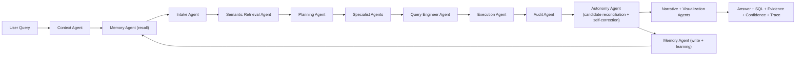

# dataDa

Status date: February 19, 2026

`dataDa` is an open-source, enterprise-focused analytics assistant that turns natural language questions into transparent, evidence-backed answers over your private data.

It is built as an agentic analytics runtime (not a plain SQL bot): agents decompose tasks, generate/query alternatives, audit results, self-correct when evidence is stronger, and keep memory of what worked.

## Why dataDa

Most AI chat tools are good at language but weak at accountable analytics on private enterprise data. dataDa is designed for:

- grounded answers (SQL + sample rows + checks)
- transparent execution (agent trace + confidence breakdown)
- bounded autonomy (self-correction without unsafe side effects)
- deployment flexibility (deterministic, local LLM, OpenAI, or auto)

## Product Scope

### Target users

- data and analytics teams
- operations and business teams that need conversational BI
- enterprises with privacy/governance constraints

### What this is

- a verifiable autonomous analytics engine
- a multi-agent data analyst teammate
- an open and inspectable runtime

### What this is not

- an unrestricted autonomous system that can silently mutate production systems
- a generic chatbot without lineage

## Current Architecture



## Bounded Autonomy (Current Definition)

Autonomy in `dataDa` is intentionally split into two layers:

- cognitive autonomy: agents can decompose tasks, generate alternatives, self-check, self-correct, and learn
- operational bounds: policies limit unsafe side effects, not intelligence

Current bounded controls exposed in API:

- `autonomy_mode`
- `auto_correction`
- `strict_truth`
- `max_refinement_rounds`
- `max_candidate_plans`

## Implemented Capabilities (as of now)

- unified ingestion path for Excel -> DuckDB (`haikugraph ingest`)
- direct existing DB attach (`haikugraph use-db --db-path ...`)
- semantic marts for transactions, quotes, customers, bookings
- runtime mode selection: `deterministic`, `local`, `openai`, `auto`
- local model listing/selection/pull via Ollama APIs
- session continuity in UI/API
- confidence scoring + audit checks + replay consistency checks
- concept alignment warnings in technical details
- persistent autonomous memory store (sidecar DB)
- feedback endpoint that can register correction rules
- autonomous candidate-plan reconciliation and auto-switch to better-grounded plan
- deterministic failure narration with explicit subquestion-level error reporting
- robust comparison execution when one side returns NULL aggregates
- multi-agent blackboard with explicit producer/consumer artifact flow
- confidence decomposition per evaluated hypothesis with contradiction resolution metadata
- correction governance APIs + UI controls for one-click enable/disable rollback
- correction rollback support with policy-gated mutation endpoints
- toolsmith lifecycle APIs (candidate -> stage -> promote -> rollback)
- durable session store (tenant-aware session isolation persisted in runtime DuckDB)
- async query jobs + status polling endpoints for concurrency and long-running requests
- per-tenant query budgets with runtime transparency in response metadata
- trust dashboard API + UI panel for success/confidence/latency/drift visibility
- source-truth parity endpoint for canonical SQL comparison over active connection
- document ingestion command for text-heavy sources (`haikugraph ingest-docs`)
- connector capability registry for DuckDB/Postgres/Snowflake/BigQuery/Stream/Documents
- startup self-healing for stale default connections (including orphaned pytest/temp paths)
- memory sidecar initialization now auto-creates parent directories to prevent boot failures
- citation-backed document QA path over ingested chunks (`datada_document_chunks`) with source snippets
- tenant-aware access context resolution (body + trusted headers + optional bearer claims + API-key policy enforcement)
- runtime SLO evaluation + incident event APIs + optional webhook emission hooks
- query timeout guardrails in UI to prevent stuck runs
- semantic profile versioning + per-domain coverage metrics in every run
- autonomy refinement rounds with per-round score/evidence tracking
- full automated test suite passing (`247 passed`, `15 skipped`)

## Quick Start

### 1. Environment

```bash
cd /Users/moenuddeenahmadshaik/Desktop/dataAssistantGenAI/haikugraph
python3 -m venv .venv
source .venv/bin/activate
pip install -e .
```

### 2. Ingest data (Excel files)

```bash
haikugraph ingest --data-dir ./data --db-path ./data/haikugraph.db --force
```

### 3. Or point to an existing database

```bash
haikugraph use-db --db-path /path/to/existing.duckdb
```

### 4. Run web app

```bash
./run.sh
# UI: http://localhost:8000
# API docs: http://localhost:8000/docs
```

## API Examples

### Query with autonomy controls

```bash
curl -s -X POST http://localhost:8000/api/assistant/query \
  -H 'Content-Type: application/json' \
  -d '{
    "goal": "What is the forex markup revenue for December 2025?",
    "llm_mode": "auto",
    "session_id": "demo-session-1",
    "autonomy_mode": "bounded",
    "auto_correction": true,
    "strict_truth": true,
    "max_refinement_rounds": 2,
    "max_candidate_plans": 6,
    "storyteller_mode": true
  }'
```

### Provide feedback and optionally teach a correction rule

```bash
curl -s -X POST http://localhost:8000/api/assistant/feedback \
  -H 'Content-Type: application/json' \
  -d '{
    "trace_id": "optional-trace-id",
    "session_id": "demo-session-1",
    "goal": "forex in december 2025",
    "issue": "Mapped to transactions when I expected quotes",
    "keyword": "forex",
    "target_table": "datada_mart_quotes",
    "target_metric": "forex_markup_revenue",
    "target_dimensions": ["__month__"]
  }'
```

## Data Stores Used by Runtime

- primary analytics DB: `HG_DB_PATH` or default `./data/haikugraph.db`
- autonomous memory DB: default `<primary_db_stem>_agent_memory.duckdb`
  - override with `HG_MEMORY_DB_PATH`
- connection registry DB map: `HG_CONNECTION_REGISTRY_PATH` or default `./data/connections.json`

## Connection Routing (New)

`db_connection_id` is now fully active in runtime.

- queries are routed to a registered connection
- per-connection team runtime is cached and reused
- sessions are scoped by `connection_id:session_id` to prevent cross-source context bleed
- UI now includes a connection selector + refresh action
- `create_app(db_path=...)` uses a sidecar registry by default, so test/one-off app instances do not overwrite the canonical `data/connections.json` (unless `HG_CONNECTION_REGISTRY_PATH` is explicitly set)

Connection APIs:

- `GET /api/assistant/connections`
- `POST /api/assistant/connections/upsert`
- `POST /api/assistant/connections/default`
- `POST /api/assistant/connections/test`

## Current POC Scope

This POC is intentionally optimized for **one primary DuckDB runtime** and full transparency.

- primary production path: unified ingest + direct attach + single DuckDB execution
- multi-warehouse/distributed execution is tracked separately under Epics 6 and 7
- autonomy is bounded for safety (read-only analytics + governed correction/tool promotion)

## Progress Tracker

POC completion (Epics 1-5): **100%**

Enterprise scale track (Epics 6-7): **in progress**

### Epic-level tracker

| Epic | Status | Completion | Notes |
|---|---|---:|---|
| 1. Unified ingestion + direct DB attach | complete | 100% | one ingestion path, direct attach, startup self-heal, legacy ingest alias removed |
| 2. Semantic intelligence reliability | complete | 100% | typed marts, semantic versioning, coverage profiling, deep overview + rare-signal discovery |
| 3. Agent autonomy core | complete | 100% | memory + correction loop + multi-round refinement + contradiction resolution + toolsmith lifecycle |
| 4. Truth and verification engine | complete | 100% | audit/replay/concept coverage + schema grounding + source-truth + SLO/incidents |
| 5. Conversational UX and transparency | complete | 100% | persistent session, mission trace, concise diagnostics, hidden advanced JSON drawer |
| 6. Enterprise platform readiness | active | 78% | tenant-aware sessions + role gating + API key policy + identity claims path + async jobs + budgets + trust telemetry |
| 7. Scale to billion-row enterprise workloads | active | 43% | async queue + connector capability model + DuckDB mirror architecture; warehouse pushdown/distributed execution pending |

### Detailed task list

#### A. Agent autonomy and learning

- [x] Persistent memory store for successful runs and outcomes
- [x] Correction rule registry and recall
- [x] Autonomous candidate-plan evaluation and switching
- [x] Feedback API to register correction rules
- [x] Multi-agent blackboard for explicit inter-agent negotiation
- [x] Autonomous toolsmith lifecycle (generate -> test -> stage -> promote)
- [x] Policy-gated self-updating procedural memory with rollback

#### B. Data platform and connectors

- [x] Unified Excel ingestion path
- [x] Existing DuckDB attach workflow
- [x] Connection registry (`connections.json`) and runtime routing via `db_connection_id`
- [x] Connection health/test/upsert/default APIs
- [x] UI connection selector and refresh control
- [x] Postgres connector (registry + DSN validation + mirror-ingest readiness)
- [x] Snowflake connector (registry + package validation + mirror-ingest readiness)
- [x] BigQuery connector (registry + package validation + mirror-ingest readiness)
- [x] Stream connector (Kafka/Kinesis URI registration + bounded snapshot readiness)
- [x] Document connector (PDF/DOCX/text) with citation-grade retrieval
- [x] Document ingestion into semantic evidence table (`datada_documents`)

#### C. Truth, quality, and explainability

- [x] Execution success checks
- [x] Non-empty checks
- [x] Time-scope checks
- [x] Concept-alignment checks
- [x] Replay consistency checks
- [x] Confidence scoring tied to audit quality
- [x] Full regression suite rerun after autonomy + connection-routing changes
- [x] Multi-plan contradiction resolution with confidence decomposition per hypothesis
- [x] Cross-source truth checks (source-of-truth SQL/warehouse parity)

#### D. Product UX

- [x] Session continuity support
- [x] Technical details panel with SQL and trace
- [x] Storyteller mode support
- [x] Runtime choice (auto/local/openai/deterministic)
- [x] Rich visual diagnostics graph (agent-to-agent artifacts)
- [x] Guided correction UX (one-click apply/rollback suggestion)
- [x] Enterprise-grade dashboards for trust metrics and drift

#### E. Enterprise readiness

- [x] Logical multi-connection routing with deterministic default selection
- [x] API-level RBAC + tenant isolation + API-key policy enforcement
- [ ] SSO/OIDC federation and external policy engine
- [ ] Durable distributed session/memory backends
- [x] Async job orchestration and queueing
- [x] Cost controls and query budgets per tenant
- [x] SLA/SLO observability and incident hooks

## What remains to reach full enterprise target

- SSO/OIDC integration and formal tenant RBAC policy store
- Distributed shared session/memory backend (Redis/Postgres) for multi-node horizontal scale
- Native pushdown connectors (Snowflake/BigQuery/Postgres) without DuckDB mirror step
- Stronger document retrieval ranking (embeddings + reranker) beyond lexical chunk scoring
- Incident hooks (PagerDuty/Slack/Webhook) and SLO burn-rate alerts

## Repo Documentation Policy

This repository intentionally uses **one canonical Markdown document**: this `README.md`.

All product, architecture, roadmap, and tracker updates should be maintained here to keep context centralized.
