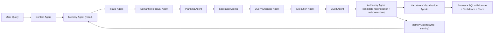

# dataDa

Status date: February 23, 2026

`dataDa` is an autonomous ecosystem of agents forming a complete data analytics team. It takes a natural language prompt, extracts semantic understanding, fetches data, performs research and probing, and delivers a final presentation that instills confidence: what data was there, what it told the system, what it means, what each agent contributed, and a transparent way to identify and correct failures.

It is built as an agentic analytics runtime with bounded autonomy: agents decompose tasks, generate and evaluate alternatives, audit results, self-correct when evidence is stronger, accumulate institutional knowledge, and defend their conclusions with evidence.

## Why dataDa

Most AI chat tools are good at language but weak at accountable analytics on private enterprise data. dataDa is designed for:

- grounded answers (SQL + sample rows + statistical validation + checks)
- transparent execution (agent trace + confidence breakdown + per-agent contribution)
- bounded autonomy (self-correction without unsafe side effects)
- institutional learning (knowledge base that grows beyond sessions and users)
- deployment flexibility (deterministic, local LLM, OpenAI, or auto)

## Product Scope

### Target users

- data and analytics teams
- operations and business teams that need conversational BI
- enterprises with privacy/governance constraints

### What this is

- a verifiable autonomous analytics engine
- a multi-agent data analyst team
- an open and inspectable runtime that accumulates institutional knowledge

### What this is not

- an unrestricted autonomous system that can silently mutate production systems
- a generic chatbot without lineage

## Current Architecture



## Bounded Autonomy

Autonomy in `dataDa` is intentionally split into two layers:

- cognitive autonomy: agents can decompose tasks, generate alternatives, self-check, self-correct, and learn
- operational bounds: policies limit unsafe side effects, not intelligence

Controls exposed in API:

- `autonomy_mode`
- `auto_correction`
- `strict_truth`
- `max_refinement_rounds`
- `max_candidate_plans`

## Quick Start

### 1. Environment

```bash
cd /Users/moenuddeenahmadshaik/Desktop/dataAssistantGenAI/haikugraph
python3 -m venv .venv
source .venv/bin/activate
pip install .
```

### 2. Ingest data (Excel files)

```bash
PYTHONPATH=src python -m haikugraph.cli ingest --data-dir ./data --db-path ./data/haikugraph.db --force
```

### 3. Or point to an existing database

```bash
PYTHONPATH=src python -m haikugraph.cli use-db --db-path /path/to/existing.duckdb
```

### 4. Run web app

```bash
./run.sh
# UI: http://localhost:8000
# API docs: http://localhost:8000/docs
```

## API Examples

### Query with autonomy controls

```bash
curl -s -X POST http://localhost:8000/api/assistant/query \
  -H 'Content-Type: application/json' \
  -d '{
    "goal": "What is the forex markup revenue for December 2025?",
    "llm_mode": "auto",
    "session_id": "demo-session-1",
    "autonomy_mode": "bounded",
    "auto_correction": true,
    "strict_truth": true,
    "max_refinement_rounds": 2,
    "max_candidate_plans": 6,
    "storyteller_mode": true
  }'
```

### Provide feedback and optionally teach a correction rule

```bash
curl -s -X POST http://localhost:8000/api/assistant/feedback \
  -H 'Content-Type: application/json' \
  -d '{
    "trace_id": "optional-trace-id",
    "session_id": "demo-session-1",
    "goal": "forex in december 2025",
    "issue": "Mapped to transactions when I expected quotes",
    "keyword": "forex",
    "target_table": "datada_mart_quotes",
    "target_metric": "forex_markup_revenue",
    "target_dimensions": ["__month__"]
  }'
```

## Data Stores Used by Runtime

- primary analytics DB: `HG_DB_PATH` or default `./data/haikugraph.db`
- autonomous memory DB: default `<primary_db_stem>_agent_memory.duckdb`
  - override with `HG_MEMORY_DB_PATH`
- connection registry DB map: `HG_CONNECTION_REGISTRY_PATH` or default `./data/connections.json`

## Connection Routing

`db_connection_id` is fully active in runtime.

- queries are routed to a registered connection
- per-connection team runtime is cached and reused
- sessions are scoped by `connection_id:session_id` to prevent cross-source context bleed
- UI includes a connection selector + refresh action

Connection APIs:

- `GET /api/assistant/connections`
- `POST /api/assistant/connections/upsert`
- `POST /api/assistant/connections/default`
- `POST /api/assistant/connections/test`

---

## Progress Tracker

### Closure Criteria Status (Current)

| Closure criterion | Status | Evidence |
|---|---|---|
| Unified ingestion + direct DB attach is production-usable for POC | complete | single ingest path (`haikugraph ingest`), direct attach (`haikugraph use-db`), connection routing in API |
| Semantic intelligence reliability for canonical analytics intents | complete | BRD factual + follow-up + parity suites passing |
| Agent autonomy core with bounded self-correction and memory | complete | autonomous correction loop + memory persistence + replay checks + correction governance APIs |
| Truth and verification engine prevents fabricated/confidently-wrong outputs | complete | behavior safety + explainability + full regression green |
| Conversational UX + transparency with a single Explain Yourself flow | complete | session continuity, async query UX path, explain modal with decision flow + SQL + checks |
| Full repository regression must be green | complete | `701 passed, 81 skipped, 5 xfailed, 10 xpassed` |

### What Was Completed In This Closure Round

- UI query path now uses async jobs (`/api/assistant/query/async`) with polling and timeout handling.
- Conversation ordering updated so newest turn appears at the top.
- Default answer card simplified to reduce jargon; deeper diagnostics are shown via **Explain Yourself**.
- Explain modal now includes explicit agent decision flow (arrow sequence), timeline, SQL, checks, and optional raw diagnostics.
- Clarification gating tuned to avoid false positives for month-only phrasing and grouped prompts.
- Memory replay guardrails tightened to avoid overwriting explicit user scope/time/grouping/filter constraints.
- Governance precheck consolidated to rely on centralized policy gates + destructive SQL block.
- Auto LLM mode now follows configurable priority (`HG_AUTO_MODE_PRIORITY`) and safely falls back to deterministic when no provider is available.
- Ingestion now writes source-truth artifacts:
  - `datada_ingestion_manifest`
  - `datada_ingestion_table_stats`
- Source-truth check endpoint now reports ingestion parity summary (table row/column parity against latest ingestion snapshot).

### Validation Run Summary

Executed with `PYTHONPATH=src` and isolated runtime/memory DB env vars:

- `pytest -q tests/test_api_runtime_features.py` -> **10 passed**
- `pytest -q tests/test_brd_behavior_safety.py` -> **24 passed**
- `pytest -q tests/test_stress.py` -> **21 passed**
- `pytest -q tests/test_brd_canonical_factual.py` -> **44 passed**
- `pytest -q tests/test_brd_followup_session.py` -> **15 passed**
- `pytest -q tests/test_brd_explainability.py` -> **18 passed**
- `pytest -q tests/test_brd_cross_mode_parity.py` -> **5 passed**
- `pytest -q` -> **701 passed, 81 skipped, 5 xfailed, 10 xpassed**

### Scope Notes

- Epics 6-7 (enterprise readiness and billion-row scale-out) remain intentionally bounded for this POC release.
- Current release target is a single DuckDB-backed runtime with strong transparency and bounded autonomy.

---

## Implemented Capabilities

- unified ingestion path for Excel/CSV/Parquet -> DuckDB (`haikugraph ingest`)
- direct existing DB attach (`haikugraph use-db --db-path ...`)
- typed semantic marts for transactions, quotes, customers, bookings
- multi-mode runtime: `deterministic`, `local`, `openai`, `anthropic`, `auto`
- configurable auto mode preference (`HG_AUTO_MODE_PRIORITY`) with deterministic fallback when providers are unavailable
- local model listing/selection/download via Ollama APIs
- session continuity in UI/API with tenant-scoped session storage
- async query jobs and status polling endpoints for non-blocking UX
- confidence scoring + audit checks + replay consistency checks
- concept alignment and policy safety checks
- persistent autonomous memory store (sidecar DuckDB)
- feedback endpoint with correction rule registration
- autonomous candidate-plan reconciliation and bounded self-correction
- multi-agent blackboard with explicit artifact flow
- correction governance APIs (list/enable/disable/rollback)
- toolsmith lifecycle APIs (candidate -> stage -> promote -> rollback)
- source-truth verification suite and parity summary against ingestion snapshots
