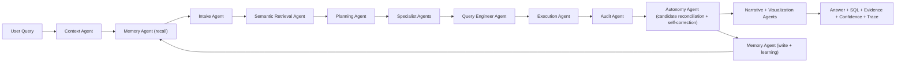

# dataDa

Status date: February 18, 2026

`dataDa` is an open-source, enterprise-focused analytics assistant that turns natural language questions into transparent, evidence-backed answers over your private data.

It is built as an agentic analytics runtime (not a plain SQL bot): agents decompose tasks, generate/query alternatives, audit results, self-correct when evidence is stronger, and keep memory of what worked.

## Why dataDa

Most AI chat tools are good at language but weak at accountable analytics on private enterprise data. dataDa is designed for:

- grounded answers (SQL + sample rows + checks)
- transparent execution (agent trace + confidence breakdown)
- bounded autonomy (self-correction without unsafe side effects)
- deployment flexibility (deterministic, local LLM, OpenAI, or auto)

## Product Scope

### Target users

- data and analytics teams
- operations and business teams that need conversational BI
- enterprises with privacy/governance constraints

### What this is

- a verifiable autonomous analytics engine
- a multi-agent data analyst teammate
- an open and inspectable runtime

### What this is not

- an unrestricted autonomous system that can silently mutate production systems
- a generic chatbot without lineage

## Current Architecture



## Bounded Autonomy (Current Definition)

Autonomy in `dataDa` is intentionally split into two layers:

- cognitive autonomy: agents can decompose tasks, generate alternatives, self-check, self-correct, and learn
- operational bounds: policies limit unsafe side effects, not intelligence

Current bounded controls exposed in API:

- `autonomy_mode`
- `auto_correction`
- `strict_truth`
- `max_refinement_rounds`
- `max_candidate_plans`

## Implemented Capabilities (as of now)

- unified ingestion path for Excel -> DuckDB (`haikugraph ingest`)
- direct existing DB attach (`haikugraph use-db --db-path ...`)
- semantic marts for transactions, quotes, customers, bookings
- runtime mode selection: `deterministic`, `local`, `openai`, `auto`
- local model listing/selection/pull via Ollama APIs
- session continuity in UI/API
- confidence scoring + audit checks + replay consistency checks
- concept alignment warnings in technical details
- persistent autonomous memory store (sidecar DB)
- feedback endpoint that can register correction rules
- autonomous candidate-plan reconciliation and auto-switch to better-grounded plan

## Quick Start

### 1. Environment

```bash
cd /Users/moenuddeenahmadshaik/Desktop/dataAssistantGenAI/haikugraph
python3 -m venv .venv
source .venv/bin/activate
pip install -e .
```

### 2. Ingest data (Excel files)

```bash
haikugraph ingest --data-dir ./data --db-path ./data/haikugraph.db --force
```

### 3. Or point to an existing database

```bash
haikugraph use-db --db-path /path/to/existing.duckdb
```

### 4. Run web app

```bash
./run.sh
# UI: http://localhost:8000
# API docs: http://localhost:8000/docs
```

## API Examples

### Query with autonomy controls

```bash
curl -s -X POST http://localhost:8000/api/assistant/query \
  -H 'Content-Type: application/json' \
  -d '{
    "goal": "What is the forex markup revenue for December 2025?",
    "llm_mode": "auto",
    "session_id": "demo-session-1",
    "autonomy_mode": "bounded",
    "auto_correction": true,
    "strict_truth": true,
    "max_refinement_rounds": 2,
    "max_candidate_plans": 6,
    "storyteller_mode": true
  }'
```

### Provide feedback and optionally teach a correction rule

```bash
curl -s -X POST http://localhost:8000/api/assistant/feedback \
  -H 'Content-Type: application/json' \
  -d '{
    "trace_id": "optional-trace-id",
    "session_id": "demo-session-1",
    "goal": "forex in december 2025",
    "issue": "Mapped to transactions when I expected quotes",
    "keyword": "forex",
    "target_table": "datada_mart_quotes",
    "target_metric": "forex_markup_revenue",
    "target_dimensions": ["__month__"]
  }'
```

## Data Stores Used by Runtime

- primary analytics DB: `HG_DB_PATH` or default `./data/haikugraph.db`
- autonomous memory DB: default `<primary_db_stem>_agent_memory.duckdb`
  - override with `HG_MEMORY_DB_PATH`
- connection registry DB map: `HG_CONNECTION_REGISTRY_PATH` or default `./data/connections.json`

## Connection Routing (New)

`db_connection_id` is now fully active in runtime.

- queries are routed to a registered connection
- per-connection team runtime is cached and reused
- sessions are scoped by `connection_id:session_id` to prevent cross-source context bleed
- UI now includes a connection selector + refresh action

Connection APIs:

- `GET /api/assistant/connections`
- `POST /api/assistant/connections/upsert`
- `POST /api/assistant/connections/default`
- `POST /api/assistant/connections/test`

## Current Limitations

- connectors beyond Excel/DuckDB are not fully productized yet (DB/stream/document connector roadmap remains)
- not yet distributed multi-tenant execution fabric (currently single-node runtime)
- autonomous tool creation is still bounded to safe probe behavior, not full dynamic plugin lifecycle
- benchmark suites are strong but still narrower than open-world enterprise query distributions

## Progress Tracker

Overall program completion toward target vision: **47%**

### Epic-level tracker

| Epic | Status | Completion | Notes |
|---|---|---:|---|
| 1. Unified ingestion + direct DB attach | active | 92% | core done; multi-connection routing added |
| 2. Semantic intelligence reliability | active | 60% | marts + mappings done; ontology/versioning pending |
| 3. Agent autonomy core | active | 58% | memory + correction loop done; richer planner negotiation pending |
| 4. Truth and verification engine | active | 63% | audit/replay/concept checks + new regression pass done |
| 5. Conversational UX and transparency | active | 57% | trace/details/story mode + connection selector done |
| 6. Enterprise platform readiness | active | 33% | connection registry/router added; RBAC/multi-tenant/SLOs pending |
| 7. Scale to billion-row enterprise workloads | backlog | 22% | DuckDB baseline works; warehouse pushdown/distributed path pending |

### Detailed task list

#### A. Agent autonomy and learning

- [x] Persistent memory store for successful runs and outcomes
- [x] Correction rule registry and recall
- [x] Autonomous candidate-plan evaluation and switching
- [x] Feedback API to register correction rules
- [ ] Multi-agent blackboard for explicit inter-agent negotiation
- [ ] Autonomous toolsmith lifecycle (generate -> test -> stage -> promote)
- [ ] Policy-gated self-updating procedural memory with rollback

#### B. Data platform and connectors

- [x] Unified Excel ingestion path
- [x] Existing DuckDB attach workflow
- [x] Connection registry (`connections.json`) and runtime routing via `db_connection_id`
- [x] Connection health/test/upsert/default APIs
- [x] UI connection selector and refresh control
- [ ] Postgres connector
- [ ] Snowflake connector
- [ ] BigQuery connector
- [ ] Stream connector (Kafka/Kinesis)
- [ ] Document connector (PDF/DOCX/text) with citation-grade retrieval

#### C. Truth, quality, and explainability

- [x] Execution success checks
- [x] Non-empty checks
- [x] Time-scope checks
- [x] Concept-alignment checks
- [x] Replay consistency checks
- [x] Confidence scoring tied to audit quality
- [x] Full regression suite rerun after autonomy + connection-routing changes
- [ ] Multi-plan contradiction resolution with confidence decomposition per hypothesis
- [ ] Cross-source truth checks (source-of-truth SQL/warehouse parity)

#### D. Product UX

- [x] Session continuity support
- [x] Technical details panel with SQL and trace
- [x] Storyteller mode support
- [x] Runtime choice (auto/local/openai/deterministic)
- [ ] Rich visual diagnostics graph (agent-to-agent artifacts)
- [ ] Guided correction UX (one-click apply/rollback suggestion)
- [ ] Enterprise-grade dashboards for trust metrics and drift

#### E. Enterprise readiness

- [x] Logical multi-connection routing with deterministic default selection
- [ ] RBAC + SSO + tenant isolation
- [ ] Durable distributed session/memory backends
- [ ] Async job orchestration and queueing
- [ ] Cost controls and query budgets per tenant
- [ ] SLA/SLO observability and incident hooks

## Repo Documentation Policy

This repository intentionally uses **one canonical Markdown document**: this `README.md`.

All product, architecture, roadmap, and tracker updates should be maintained here to keep context centralized.
